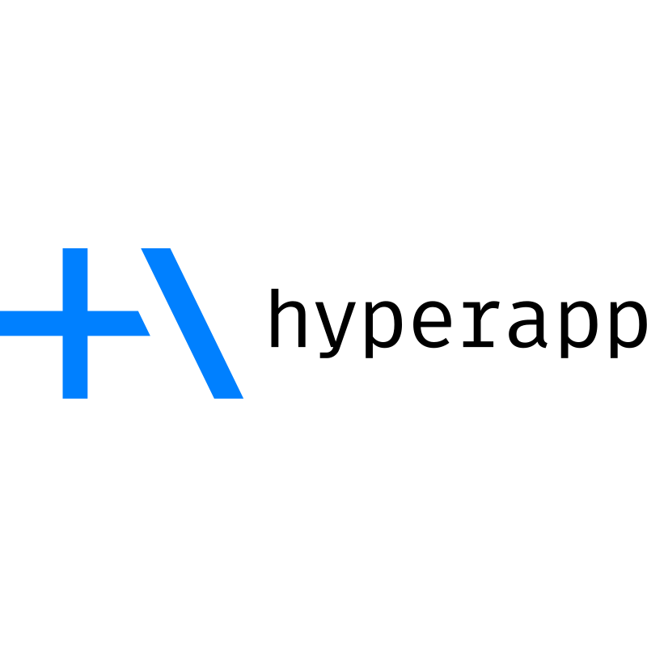
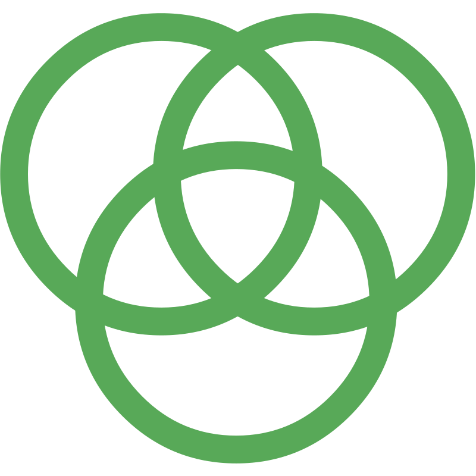
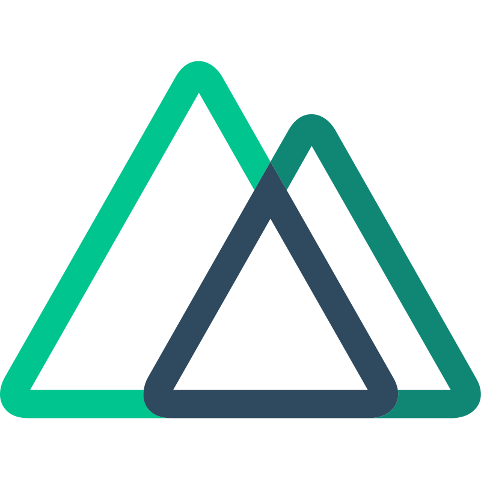

## A

 [AJAX](https://raw.githubusercontent.com/prplx/svg-logos/master/svg/AJAX.svg) |  [Angular](https://raw.githubusercontent.com/prplx/svg-logos/master/svg/Angular.svg) |  [Apollo](https://raw.githubusercontent.com/prplx/svg-logos/master/svg/Apollo.svg) |  [Astro](https://raw.githubusercontent.com/prplx/svg-logos/master/svg/Astro.svg) |  [Astro Alt](https://raw.githubusercontent.com/prplx/svg-logos/master/svg/Astro-Alt.svg) |  [AWS](https://raw.githubusercontent.com/prplx/svg-logos/master/svg/AWS.svg) |  [Azure](https://raw.githubusercontent.com/prplx/svg-logos/master/svg/Azure.svg)

## B

 [Babel](https://raw.githubusercontent.com/prplx/svg-logos/master/svg/Babel.svg) |  [Backbone](https://raw.githubusercontent.com/prplx/svg-logos/master/svg/Backbone.svg) |  [Bootstrap](https://raw.githubusercontent.com/prplx/svg-logos/master/svg/Bootstrap.svg) |  [Bower](https://raw.githubusercontent.com/prplx/svg-logos/master/svg/Bower.svg) |  [Browserify](https://raw.githubusercontent.com/prplx/svg-logos/master/svg/Browserify.svg)

## C

 [Chai](https://raw.githubusercontent.com/prplx/svg-logos/master/svg/Chai.svg) |  [CoffeeScript](https://raw.githubusercontent.com/prplx/svg-logos/master/svg/CoffeeScript.svg) |  [CSS3](https://raw.githubusercontent.com/prplx/svg-logos/master/svg/CSS3.svg) |  [CycleJS](https://raw.githubusercontent.com/prplx/svg-logos/master/svg/CycleJS.svg) |  [Cypress](https://raw.githubusercontent.com/prplx/svg-logos/master/svg/Cypress.svg)

## D

 [D3](https://raw.githubusercontent.com/prplx/svg-logos/master/svg/D3.svg) |  [Docker](https://raw.githubusercontent.com/prplx/svg-logos/master/svg/Docker.svg)

## E

 [Elm](https://raw.githubusercontent.com/prplx/svg-logos/master/svg/Elm.svg) |  [Ember](https://raw.githubusercontent.com/prplx/svg-logos/master/svg/Ember.svg) |  [ESLint](https://raw.githubusercontent.com/prplx/svg-logos/master/svg/ESLint.svg) |  [Express](https://raw.githubusercontent.com/prplx/svg-logos/master/svg/Express.svg)

## F

 [Firebase](https://raw.githubusercontent.com/prplx/svg-logos/master/svg/Firebase.svg) |  [Flow](https://raw.githubusercontent.com/prplx/svg-logos/master/svg/Flow.svg)

## G

 [Git](https://raw.githubusercontent.com/prplx/svg-logos/master/svg/Git.svg) |  [Github](https://raw.githubusercontent.com/prplx/svg-logos/master/svg/Github.svg) |  [Github Alt](https://raw.githubusercontent.com/prplx/svg-logos/master/svg/Github-Alt.svg) |  [Gitlab](https://raw.githubusercontent.com/prplx/svg-logos/master/svg/Gitlab.svg) |  [Gitlab Alt](https://raw.githubusercontent.com/prplx/svg-logos/master/svg/Gitlab-Alt.svg) |  [Go](https://raw.githubusercontent.com/prplx/svg-logos/master/svg/Go.svg) |  [GraphQL](https://raw.githubusercontent.com/prplx/svg-logos/master/svg/GraphQL.svg) |  [Grunt](https://raw.githubusercontent.com/prplx/svg-logos/master/svg/Grunt.svg) |  [Gulp](https://raw.githubusercontent.com/prplx/svg-logos/master/svg/Gulp.svg)

## H

 [Handlebars](https://raw.githubusercontent.com/prplx/svg-logos/master/svg/Handlebars.svg) |  [HTML5](https://raw.githubusercontent.com/prplx/svg-logos/master/svg/HTML5.svg) |  [Hyperapp](https://raw.githubusercontent.com/prplx/svg-logos/master/svg/Hyperapp.svg)

## I

 [Inferno](https://raw.githubusercontent.com/prplx/svg-logos/master/svg/Inferno.svg)

## J

 [Jasmine](https://raw.githubusercontent.com/prplx/svg-logos/master/svg/Jasmine.svg) |  [JavaScript](https://raw.githubusercontent.com/prplx/svg-logos/master/svg/JavaScript.svg) |  [Jest](https://raw.githubusercontent.com/prplx/svg-logos/master/svg/Jest.svg) |  [jQuery](https://raw.githubusercontent.com/prplx/svg-logos/master/svg/jQuery.svg)

## K

 [KnockoutJS](https://raw.githubusercontent.com/prplx/svg-logos/master/svg/KnockoutJS.svg) |  [Kubernetes](https://raw.githubusercontent.com/prplx/svg-logos/master/svg/Kubernetes.svg)

## L

 [Less](https://raw.githubusercontent.com/prplx/svg-logos/master/svg/Less.svg)

## M

 [Marionette](https://raw.githubusercontent.com/prplx/svg-logos/master/svg/Marionette.svg) |  [Materialize](https://raw.githubusercontent.com/prplx/svg-logos/master/svg/Materialize.svg) |  [Meteor](https://raw.githubusercontent.com/prplx/svg-logos/master/svg/Meteor.svg) |  [Mithril](https://raw.githubusercontent.com/prplx/svg-logos/master/svg/Mithril.svg) |  [MobX](https://raw.githubusercontent.com/prplx/svg-logos/master/svg/MobX.svg) |  [MongoDB](https://raw.githubusercontent.com/prplx/svg-logos/master/svg/MongoDB.svg)

## N

 [Nest](https://raw.githubusercontent.com/prplx/svg-logos/master/svg/Nest.svg) |  [NextJS](https://raw.githubusercontent.com/prplx/svg-logos/master/svg/NextJS.svg) |  [NextJS Alt](https://raw.githubusercontent.com/prplx/svg-logos/master/svg/NextJS-Alt.svg) |  [NodeJS](https://raw.githubusercontent.com/prplx/svg-logos/master/svg/NodeJS.svg) |  [npm](https://raw.githubusercontent.com/prplx/svg-logos/master/svg/npm.svg) |  [NuxtJS](https://raw.githubusercontent.com/prplx/svg-logos/master/svg/NuxtJS.svg) |  [NuxtJS Alt](https://raw.githubusercontent.com/prplx/svg-logos/master/svg/NuxtJS-Alt.svg)

## P

 [Polymer](https://raw.githubusercontent.com/prplx/svg-logos/master/svg/Polymer.svg) |  [PostCSS](https://raw.githubusercontent.com/prplx/svg-logos/master/svg/PostCSS.svg) |  [Preact](https://raw.githubusercontent.com/prplx/svg-logos/master/svg/Preact.svg) |  [Prisma](https://raw.githubusercontent.com/prplx/svg-logos/master/svg/Prisma.svg) |  [Prisma Alt](https://raw.githubusercontent.com/prplx/svg-logos/master/svg/Prisma-Alt.svg)

## Q

 [Qwik](https://raw.githubusercontent.com/prplx/svg-logos/master/svg/Qwik.svg)

## R

 [React](https://raw.githubusercontent.com/prplx/svg-logos/master/svg/React.svg) |  [ReasonML](https://raw.githubusercontent.com/prplx/svg-logos/master/svg/ReasonML.svg) |  [Redux](https://raw.githubusercontent.com/prplx/svg-logos/master/svg/Redux.svg) |  [Relay](https://raw.githubusercontent.com/prplx/svg-logos/master/svg/Relay.svg) |  [Remix](https://raw.githubusercontent.com/prplx/svg-logos/master/svg/Remix.svg) |  [Remix Alt](https://raw.githubusercontent.com/prplx/svg-logos/master/svg/Remix-Alt.svg) |  [RxJS](https://raw.githubusercontent.com/prplx/svg-logos/master/svg/RxJS.svg)

## S

 [Sass](https://raw.githubusercontent.com/prplx/svg-logos/master/svg/Sass.svg) |  [SemanticUI](https://raw.githubusercontent.com/prplx/svg-logos/master/svg/SemanticUI.svg) |  [SolidJS](https://raw.githubusercontent.com/prplx/svg-logos/master/svg/SolidJS.svg) |  [SolidJS Alt](https://raw.githubusercontent.com/prplx/svg-logos/master/svg/SolidJS-Alt.svg) |  [Stylus](https://raw.githubusercontent.com/prplx/svg-logos/master/svg/Stylus.svg) |  [Supabase](https://raw.githubusercontent.com/prplx/svg-logos/master/svg/Supabase.svg) |  [Svelte](https://raw.githubusercontent.com/prplx/svg-logos/master/svg/Svelte.svg) |  [SvelteKit](https://raw.githubusercontent.com/prplx/svg-logos/master/svg/SvelteKit.svg)

## T

 [TailwindCSS](https://raw.githubusercontent.com/prplx/svg-logos/master/svg/TailwindCSS.svg) |  [TailwindCSS Alt](https://raw.githubusercontent.com/prplx/svg-logos/master/svg/TailwindCSS-Alt.svg) |  [tRPC](https://raw.githubusercontent.com/prplx/svg-logos/master/svg/tRPC.svg) |  [tRPC Alt](https://raw.githubusercontent.com/prplx/svg-logos/master/svg/tRPC-Alt.svg) |  [TypeScript](https://raw.githubusercontent.com/prplx/svg-logos/master/svg/TypeScript.svg) |  [TypeScript Alt](https://raw.githubusercontent.com/prplx/svg-logos/master/svg/TypeScript-Alt.svg)

## V

 [Vercel](https://raw.githubusercontent.com/prplx/svg-logos/master/svg/Vercel.svg) |  [Vercel Alt](https://raw.githubusercontent.com/prplx/svg-logos/master/svg/Vercel-Alt.svg) |  [Vue](https://raw.githubusercontent.com/prplx/svg-logos/master/svg/Vue.svg)

## W

 [Webpack](https://raw.githubusercontent.com/prplx/svg-logos/master/svg/Webpack.svg)

## Y

 [Yarn](https://raw.githubusercontent.com/prplx/svg-logos/master/svg/Yarn.svg) |  [Yeoman](https://raw.githubusercontent.com/prplx/svg-logos/master/svg/Yeoman.svg)

## Z

 [Zod](https://raw.githubusercontent.com/prplx/svg-logos/master/svg/Zod.svg) |  [Zurb](https://raw.githubusercontent.com/prplx/svg-logos/master/svg/Zurb.svg) |  [Zustand](https://raw.githubusercontent.com/prplx/svg-logos/master/svg/Zustand.svg)